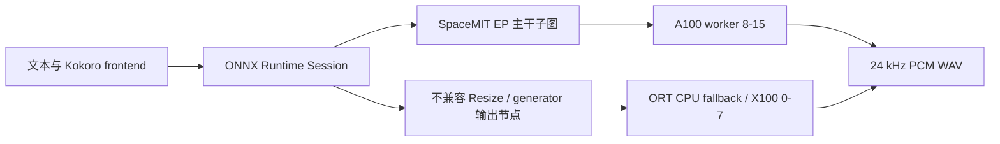

# SpaceMIT K3 Kokoro TTS：A100 实时推理适配与实测

本仓库记录 Kokoro TTS 在 SpaceMIT K3/riscv64 板端的完整适配、构建、A100 绑核、性能测试和已知限制。实现基于：

- [SpaceMIT Kokoro Model Zoo](https://archive.spacemit.com/spacemit-ai/model_zoo/tts/kokoro/)
- [SpaceMIT model-zoo-tts](https://github.com/spacemit-com/model-zoo-tts)
- SpaceMIT ONNX Runtime / Execution Provider `2.0.6`

> **结论先行：**预热后的持久进程中，KOKORO_EN 实测 warm RTF `0.342`，KOKORO_ZH 实测 warm RTF `0.256`，均达到或优于官方 README 的 `0.41` 和 `0.29`。当前方案是 **A100 上的 SpaceMIT EP 主干子图 + X100 CPU fallback**，不是全模型纯 NPU。

## 1. 实测环境

| 项目 | 实测值 |
|---|---|
| 板卡 | `bianbu-spacemitk3picoitx` |
| 架构 | `riscv64` |
| 系统 | Bianbu 4.0.6 |
| Kernel | 6.18.3 |
| CPU 拓扑 | `0-7 = spacemit,x100`，`8-15 = spacemit,a100` |
| ONNX Runtime | 1.24.2 |
| SpaceMIT EP | 2.0.6 |
| 输出格式 | 24 kHz、16-bit PCM、mono WAV |
| 英文模型/音色 | `kokoro-v1.0-en.q.onnx` / `af_heart` |
| 中文模型/音色 | `kokoro-v1.1-zh.q.onnx` / `zf_001` |

板端测试路径曾为 `/home/spacemit/projects/kokoro-tts`。运行脚本会根据脚本自身位置解析仓库根目录，不依赖固定的克隆路径。SpaceMIT ORT/EP 推荐安装到板端系统目录 `/usr/local`；`SPACEMIT_ORT_ROOT` 仅用于明确指定一个私有 Bundle。

## 2. 性能结果

官方 README 的测试口径为：相同文本执行 3 次，取 RTF 中位数，引擎初始化和 warmup 不计入处理时间。本仓库用同样的文本，在同一个 engine 中 `--repeat 3`，将第 2、3 次作为稳态结果。

### 2.1 与官方目标对比

| 后端 | 测试文本 | 本地音频时长 | warm 处理时间中位数 | warm RTF | 官方处理时间 / RTF |
|---|---|---:|---:|---:|---:|
| KOKORO_EN | `This is a spacemit k3 kokoro performance test.` | 3625 ms | 1240.5 ms | **0.342** | 2026 ms / 0.41 |
| KOKORO_ZH | `这是一个语音合成测试` | 3025 ms | 774 ms | **0.256** | 870 ms / 0.29 |

恢复任务后的独立冒烟复测：

| 后端 | 音频时长 | 处理时间 | RTF | warmup |
|---|---:|---:|---:|---:|
| KOKORO_EN | 3625 ms | 1229 ms | 0.339 | 4926 ms |
| KOKORO_ZH | 3025 ms | 847 ms | 0.280 | 4254 ms |

中文音频时长与官方 `3025 ms` 一致。英文当前生成 `3625 ms`，而官方表中为 `4950 ms`，说明本地 frontend/词典路径与官方英文性能表仍存在时长口径差异。虽然相同英文测试字符串的处理时间和 RTF 已达到目标，但不能宣称完全复现官方英文音频时长。

### 2.2 A100 EP worker 数量矩阵

| 语言 | EP worker | 绑定核心 | warm 处理时间中位数 | warm RTF |
|---|---:|---|---:|---:|
| EN | 1 | `8` | 3757.5 ms | 1.037 |
| EN | 2 | `8;9` | 2356 ms | 0.650 |
| EN | 4 | `8;9;10;11` | 1613.5 ms | 0.445 |
| EN | 8 | `8;9;10;11;12;13;14;15` | **1240.5 ms** | **0.342** |
| ZH | 1 | `8` | 2021.5 ms | 0.668 |
| ZH | 2 | `8;9` | 1240.5 ms | 0.410 |
| ZH | 4 | `8;9;10;11` | 893.5 ms | 0.295 |
| ZH | 8 | `8;9;10;11;12;13;14;15` | **774 ms** | **0.256** |

最终默认选择 8 个 EP worker。测试时检查 `/proc/<pid>/task/*/status`，观察到 8 个 EP worker 的 `Cpus_allowed_list` 分别为 `8`、`9`、`10`、`11`、`12`、`13`、`14`、`15`；应用和 CPU fallback 线程仍为 `0-7`。这证明 A100 亲和性实际生效，而不只是设置了环境变量。新增的 2 核验证使用 `--cores 8,10`，启动日志明确显示 `ep_threads=2, affinity=8;10`；长英文文本 RTF 为 `0.969`，中文短文本 RTF 为 `0.499`，两者仍然低于 1。

原始最终日志保留在：

- [`docs/evidence/en-a100-t8-repeat3.log`](docs/evidence/en-a100-t8-repeat3.log)
- [`docs/evidence/zh-a100-t8-repeat3.log`](docs/evidence/zh-a100-t8-repeat3.log)
- [`docs/evidence/en-a100-smoke.log`](docs/evidence/en-a100-smoke.log)
- [`docs/evidence/final-repo-en-a100.log`](docs/evidence/final-repo-en-a100.log)
- [`docs/evidence/final-repo-zh-a100.log`](docs/evidence/final-repo-zh-a100.log)
- [`docs/evidence/core2-en-a100.log`](docs/evidence/core2-en-a100.log)
- [`docs/evidence/core2-en-a100-short.log`](docs/evidence/core2-en-a100-short.log)
- [`docs/evidence/core2-zh-a100.log`](docs/evidence/core2-zh-a100.log)
- [`docs/evidence/system-ort-interactive-short.log`](docs/evidence/system-ort-interactive-short.log)
- [`docs/evidence/system-ort-linkage.txt`](docs/evidence/system-ort-linkage.txt)
- [`docs/evidence/system-ort-cmake-reconfigure.log`](docs/evidence/system-ort-cmake-reconfigure.log)
- [`docs/evidence/final-system-rebuild.log`](docs/evidence/final-system-rebuild.log)
- [`docs/evidence/final-system-e2e.log`](docs/evidence/final-system-e2e.log)
- [`docs/evidence/final-system-interactive.log`](docs/evidence/final-system-interactive.log)
- [`docs/evidence/final-system-linkage.log`](docs/evidence/final-system-linkage.log)

其中 `final-repo-*-a100.log` 是清理前完成的全新板端构建后的最终端到端复测日志；两次均生成了可播放的 24 kHz WAV，且运行退出后未留下独立的 `tts_file_demo` 进程。`core2-en-a100-short.log` 和 `core2-zh-a100.log` 是新增的部分 A100 核验证日志，包含 EP 初始化时打印的实际 affinity；`core2-en-a100.log` 另外记录了长文本压力测试。

`system-ort-interactive-short.log` 是改为系统安装 ORT/EP 后的交互式复核：使用 `--cores 8,10`，两条短中文输入分别得到 RTF `0.467` 和 `0.446`，都覆盖写入同一个 WAV；`system-ort-linkage.txt` 记录了 CMake 命中 `/usr/local` 以及板端 `ldd` 的实际解析结果；`system-ort-cmake-reconfigure.log` 记录了清理旧缓存后重新配置和构建成功。

在本次提交前又执行了一次**删除 `build-k3` 后的干净板端重编译**，并完成最终端到端复测：

- `final-system-rebuild.log`：从零开始配置和编译，最终 `tts_file_demo` 构建成功；
- `final-system-e2e.log`：A100 `8-15`，英文 warm RTF `0.324628/0.323967`，中文 warm RTF `0.261944/0.258889`，英文和中文均生成 `24 kHz / 16-bit / mono` WAV；
- `final-system-interactive.log`：A100 `8,10`，两条交互式中文请求 RTF `0.455949/0.428861`，均覆盖写入同一个 WAV，退出后没有残留 `tts_file_demo`；
- `final-system-linkage.log`：干净构建的 CMake cache、ELF 和 `ldd` 均确认 ORT/EP 来自 `/usr/local`。

参考 WAV：

- [`examples/audio/kokoro-en-a100.wav`](examples/audio/kokoro-en-a100.wav)
- [`examples/audio/kokoro-zh-a100.wav`](examples/audio/kokoro-zh-a100.wav)

## 3. 运行架构和能力边界



当前 ORT/EP 2.0.6 对官方 Kokoro 图中的 rank-3 `Resize` 会错误扩大时间维，随后在残差 `Add` 出现形状广播错误：

- 中文：曾在 `/N.1/Add` 观察到 `201 by 402`；
- 英文：曾在 `/encoder/F0.1/Add` 观察到类似问题。

因此源码显式把以下节点留给 ORT CPU fallback：

- 英文/中文图中的 6 个 rank-3 `Resize`；
- generator 输出卷积/转置卷积节点，避免输出形状或音质异常。

启动日志中的 `operator ... has been disabled` 是这些 fallback 节点的证据。准确能力表述应为：

> SpaceMIT EP 执行可支持的主干子图，EP worker 绑定 A100；少量 Resize 和 generator 输出节点由 X100 CPU fallback，完成端到端 WAV 生成。

不能表述为“全图 NPU”或“全模型纯 A100”。

## 4. 仓库结构

```text
.
├── README.md
├── models-MANIFEST.md              # 模型来源、大小和校验值
├── docs/evidence/                  # 最终性能原始日志
├── examples/audio/                 # 最终验证 WAV
├── official-model-zoo/
│   ├── v1.0-en/                    # 已提交英文 ONNX 和必要资产
│   └── v1.1-zh/                    # 中文小型资产；ONNX 首次运行下载
├── scripts/
│   ├── download_models.sh          # 手工下载两套官方包并校验 MD5
│   └── prepare_local_deps.sh       # 无 root 下载/解压 riscv64 开发依赖
└── spacemit/
    ├── case/model-zoo-k3/
    │   ├── run.sh
    │   └── run_a100.sh
    └── model-zoo-tts/              # 上游源码及本次 K3 适配
```

已删除的无用内容包括：

- sherpa-onnx CPU/FP32/INT8 对照模型及重复词典；
- 官方模型压缩包副本；
- 旧 CPU/EP WAV、临时输出、profile JSON 和 100 多个 EP subgraph dump；
- `.case-home` 下载缓存；
- `.local-deps` 解压产物；
- `build-k3` 编译目录和目标文件。

## 5. 模型策略

英文 ONNX 为 83,690,161 bytes，小于 GitHub 普通 Git 的 100 MB 单文件限制，因此连同 `af_heart` 音色和英文词典一起提交。

中文 ONNX 为 144,349,536 bytes，超过 GitHub 100 MB 单文件限制，因此不直接提交。首次中文运行时，组件会从 SpaceMIT 官方镜像下载并解压完整中文包。模型来源、SHA-256 和压缩包 MD5 见 [`models-MANIFEST.md`](models-MANIFEST.md)。

也可预先下载两套模型：

```bash
./scripts/download_models.sh
```

默认目录：

```text
~/.cache/models/tts/kokoro-tts/
├── kokoro-v1.0-en/
└── kokoro-v1.1-zh/
```

## 6. 板端依赖

推荐先安装开发包：

```bash
sudo apt update
sudo apt install -y \
  build-essential cmake git curl espeak-ng \
  libsndfile1-dev libfftw3-dev libcurl4-openssl-dev libespeak-ng-dev
```

如果板端没有 sudo 权限，可将 riscv64 开发包解压到源码目录：

```bash
./scripts/prepare_local_deps.sh
```

CMake 已加入 `.local-deps/usr/...` 的 FFTW 和 libcurl fallback；该目录是可再生构建依赖，不提交到 Git。

还需要板端可用的 SpaceMIT ONNX Runtime/EP 2.0.6。推荐把已有 Bundle 安装到系统目录，而不是让仓库或运行脚本依赖某个用户的 home 路径。

假设 Bundle 当前位于任意目录（下面只是本次板端测试使用的示例源路径）：

```text
/home/spacemit/projects/qwen3-tts/spacemit-ort.riscv64.2.0.6/
├── include/onnxruntime_cxx_api.h
├── include/spacemit_ort_env.h
└── lib/libonnxruntime.so
    libspacemit_ep.so
```

在板端从仓库根目录执行一次安装：

```bash
./scripts/install_spacemit_ort.sh \
  /home/spacemit/projects/qwen3-tts/spacemit-ort.riscv64.2.0.6
```

默认安装位置为：

```text
/usr/local/include/
/usr/local/lib/
/etc/ld.so.conf.d/spacemit-ort.conf
```

脚本在需要时自动调用 `sudo`，复制头文件和共享库，并运行 `ldconfig`。安装完成后可检查：

```bash
ldconfig -p | grep -E 'lib(onnxruntime|spacemit_ep)\.so'
ls -l /usr/local/include/onnxruntime_cxx_api.h \
      /usr/local/include/spacemit_ort_env.h \
      /usr/local/lib/libonnxruntime.so \
      /usr/local/lib/libspacemit_ep.so
```

如果没有 root 权限，也可以把 Bundle 保留在用户目录中，临时通过 `SPACEMIT_ORT_ROOT` 覆盖；这只是备用开发方式，不是仓库的默认依赖。

## 7. 构建

```bash
git clone git@github.com:Fitz8863/spacemitk3-Kokoro-tts.git
cd spacemitk3-Kokoro-tts

# 系统安装模式：不要设置 SPACEMIT_ORT_ROOT，CMake 自动搜索 /usr/local 和 /usr/lib。
unset SPACEMIT_ORT_ROOT
cmake -S spacemit/model-zoo-tts \
  -B spacemit/model-zoo-tts/build-k3

cmake --build spacemit/model-zoo-tts/build-k3 -j4
```

若该板端以前用旧命令配置过 `build-k3`，建议清理一次 CMake 缓存，避免旧的绝对路径缓存继续参与配置：

```bash
rm -rf spacemit/model-zoo-tts/build-k3
cmake -S spacemit/model-zoo-tts -B spacemit/model-zoo-tts/build-k3
cmake --build spacemit/model-zoo-tts/build-k3 -j4
```

也可以明确使用私有 Bundle（仅当确实需要时）：

```bash
cmake -S spacemit/model-zoo-tts \
  -B spacemit/model-zoo-tts/build-k3 \
  -DSPACEMIT_ORT_ROOT=/path/to/spacemit-ort.riscv64.2.0.6
```

成功产物：

```text
spacemit/model-zoo-tts/build-k3/bin/tts_file_demo
```

注意：`build-k3` 和其中的二进制文件不会提交到 GitHub；重新克隆仓库或拉取本次交互模式修改后，需要在板端重新执行上面的 CMake 构建。运行脚本现在会在二进制不存在时打印对应的构建命令，而不是直接显示 shell 的“没有那个文件或目录”。

本次板端复核构建结果：

```text
[ 16%] Built target fst
[ 35%] Built target kaldifst_core
[ 96%] Built target tts
[100%] Built target tts_file_demo
```

## 8. A100 推荐运行方法

```bash
cd spacemit/case/model-zoo-k3

# 中文；首次缺少中文 ONNX 时会自动下载官方包
./run_a100.sh zh kokoro-zh-a100.wav \
  '这是一个语音合成测试'

# 英文
./run_a100.sh en kokoro-en-a100.wav \
  'This is a spacemit k3 kokoro performance test.'
```

同进程重复 3 次，复现稳态 RTF：

```bash
./run_a100.sh zh kokoro-zh-repeat3.wav \
  '这是一个语音合成测试' 3

./run_a100.sh en kokoro-en-repeat3.wav \
  'This is a spacemit k3 kokoro performance test.' 3
```

`run_a100.sh` 默认使用全部 A100 核，但现在可以通过 `--cores` 精确选择参与计算的核。

```text
SPACEMIT_TTS_EP_THREADS=8
SPACEMIT_TTS_EP_CORES=8-15
SPACEMIT_TTS_EP_AFFINITY=8;9;10;11;12;13;14;15
SPACEMIT_TTS_WARMUP_RUNS=1
```

`SPACEMIT_TTS_EP_CORES` 是面向用户的核列表参数，支持逗号列表、范围、空格或分号分隔。例如：

```bash
# 只使用两个 A100 核 8、10；EP worker 数自动设置为 2
./run_a100.sh zh kokoro-zh-a100-2core.wav \
  '这是一个语音合成测试' --cores 8,10

# 使用四个 A100 核 8、10、12、14
./run_a100.sh en kokoro-en-a100-4core.wav \
  'This is a spacemit k3 kokoro performance test.' --cores 8,10,12,14

# 使用连续的 A100 核 8-11，并重复 3 次测试稳态 RTF
./run_a100.sh zh kokoro-zh-a100-4core-repeat3.wav \
  '这是一个语音合成测试' 3 --cores 8-11
```

推荐使用逗号或范围格式；分号格式必须加引号，避免被 shell 当成命令分隔符。脚本会自动把核列表转换为 SpaceMIT EP 需要的 `8;10;12` 格式，并将 `SPACEMIT_TTS_EP_THREADS` 设置为所选核数。如果手工同时设置了 `SPACEMIT_TTS_EP_THREADS`，它必须与核数一致，否则脚本直接报错。

参数优先级为：命令行 `--cores` > 环境变量 `SPACEMIT_TTS_EP_CORES` > 兼容旧参数 `SPACEMIT_TTS_EP_AFFINITY` > 默认 `8-15`。例如：

```bash
SPACEMIT_TTS_EP_CORES=8,11 \
  ./run_a100.sh zh output.wav '这是一个语音合成测试'
```

通用入口：

```text
run.sh <zh|en> <output.wav> <text> [spacemit|cpu] [ep-cores] [repeat]
```

直接使用通用入口时，同样可以指定 `8,10`、`8-11` 等核列表；CPU provider 会忽略 EP 核绑定参数。

CPU 对照示例：

```bash
./run.sh zh kokoro-zh-cpu.wav '这是一个语音合成测试' cpu
```

### 8.1 交互式常驻合成

当前 K3 入口支持交互式模式：程序只初始化一次 Kokoro 引擎并保持进程常驻，之后每输入一行文本并按 Enter 就生成一次 WAV。所有请求写入同一个输出路径，因此后一次成功合成会覆盖前一次文件，不会生成 `output_1.wav`、`output_2.wav` 等递增文件。

```bash
cd spacemit/case/model-zoo-k3

# 默认使用 A100 8-15；启动后逐行输入文本
./run_a100.sh zh interactive.wav --interactive

# 只使用指定的 A100 核，例如 8 和 10
./run_a100.sh zh interactive.wav --interactive --cores 8,10
```

运行时示例：

```text
初始化 TTS 引擎 (kokoro:zh)...
进入交互模式，输入文本后按 Enter 合成 (输入 q 退出)
> 第一条文本
合成中: "第一条文本"
已保存: interactive.wav
> 第二条文本
合成中: "第二条文本"
已保存: interactive.wav
> q
再见!
```

说明：

- 空行会被忽略；输入 `q`、`quit` 或 `exit` 退出，Ctrl-D 也可以结束 stdin。
- `interactive.wav` 必须由调用方提前确定；每次成功合成都覆盖该文件。
- 引擎、模型和 SpaceMIT EP 只初始化一次，适合连续输入，避免每条文本重复承担约 4--5 秒启动/warmup 开销。
- 合成期间程序会同步处理当前文本；下一行应在当前请求完成后输入，适合单路交互，不是并发队列服务。
- 交互模式同样支持 `--cores`，例如 `--cores 8,10` 或 `--cores 8-11`。

通用入口也支持同样模式：

```bash
./run.sh zh interactive.wav --interactive spacemit '8;10'
```

其中通用入口的交互式参数顺序是：

```text
run.sh <zh|en> <output.wav> --interactive [spacemit|cpu] [ep-cores]
```

运行脚本默认从 `/usr/local/lib`、`/usr/lib/riscv64-linux-gnu` 和 `/usr/lib` 加载系统安装的 ORT/EP，不需要设置任何用户目录变量。

只有在使用私有 Bundle 时才设置覆盖：

```bash
SPACEMIT_ORT_ROOT=/path/to/spacemit-ort.riscv64.2.0.6 \
  ./run_a100.sh zh output.wav '这是一个语音合成测试'
```

## 9. 为什么必须预热并保持引擎常驻

模型加载、EP 初始化、动态 shape 和缓存建立需要约 4--5 秒。本仓库默认在 engine 初始化阶段执行一次 warmup，使第一条用户请求获得接近稳态的 RTF。

正确的线上方式：

1. 服务启动时创建一个 `TtsEngine`；
2. 初始化阶段执行 warmup；
3. 后续请求复用同一个 engine；
4. 不要每条请求都重新启动 `tts_file_demo`。

如果把每次进程启动和 warmup 都计入用户请求，则无法达到表中的稳态实时指标。官方 README 的性能表同样明确不把初始化和 warmup 计入处理时间。

## 10. 验证 A100 亲和性

长文本推理期间执行：

```bash
pid=$(pgrep -n tts_file_demo)
for status in /proc/$pid/task/*/status; do
  awk '/^Name:|^Pid:|^Cpus_allowed_list:/' "$status"
done
```

应观察到所选核列表对应的 EP worker。例如使用 `--cores 8,10` 时，应看到两个 EP worker 的 `Cpus_allowed_list` 分别为 `8` 和 `10`；应用和 ORT CPU fallback 线程仍可能显示为 `0-7`。

SSH 会话本身可能继承 `Cpus_allowed_list: 0-7`，所以不建议直接对整个进程执行 `taskset -c 8-15`。本仓库通过 SpaceMIT EP 的 `SPACEMIT_EP_INTRA_THREAD_AFFINITY` 参数只绑定 EP worker，不会强制移动应用线程或 CPU fallback 线程。

核数越少不一定线性变慢，但会减少 A100 占用。当前实测矩阵已经表明中文从 8 个 EP worker 减少到 4 个仍约为 RTF `0.295`，英文 4 个约为 RTF `0.445`；如果业务只要求实时合成，可以优先尝试 2 或 4 个 A100 核，再根据实际文本长度和并发量选择配置。

## 11. 已知限制

1. 当前是部分 EP + CPU fallback，不是全图 NPU。
2. 英文音频时长未完全复现官方表的 4950 ms。
3. 中文 ONNX 超过 GitHub 普通 Git 单文件限制，首次使用需联网下载或手工放入缓存。
4. 采样率固定为 24 kHz。
5. 当前案例仅验证官方包内的预置音色，不包含训练、微调、参考音频克隆或自定义声线导出。
6. `espeak-ng` 和词典共同承担英文 frontend；其他系统复用时应先检查 `command -v espeak-ng`。
7. 当前 fallback 节点列表针对测试时的 SpaceMIT EP 2.0.6；升级 EP 后应重新验证分图、输出形状、音质和 RTF，不能直接假定仍需相同 fallback。

## 12. 关键源码改动

- `kokoro_backend.cpp`
  - 读取 `SPACEMIT_TTS_EP_AFFINITY`；
  - 传递为 `SPACEMIT_EP_INTRA_THREAD_AFFINITY`；
  - affinity 数量必须与 `SPACEMIT_TTS_EP_THREADS` 匹配。
- `kokoro_en_backend.cpp`
  - 英文图中的 6 个 rank-3 Resize 和 generator 输出节点进入 CPU fallback。
- `kokoro_zh_backend.cpp`
  - 中文图中的 6 个 rank-3 Resize 和 generator 输出节点进入 CPU fallback。
- `CMakeLists.txt`
  - 默认从 `/usr/local`、`/usr/include` 和系统库目录查找 ORT/EP；
  - 支持 `-DSPACEMIT_ORT_ROOT=...` 或环境变量作为私有 Bundle 覆盖；
  - 支持从 `.local-deps` 查找 FFTW/libcurl，方便无 root 的板端构建。
- `scripts/install_spacemit_ort.sh`
  - 将 SpaceMIT ORT/EP Bundle 安装到 `/usr/local`，并注册动态链接器搜索路径。
- `run_a100.sh`
  - 支持 `--cores 8,10`、`--cores 8-11` 等具体核列表；
  - 根据所选核数自动设置 EP worker 数，并检查手工设置的线程数是否匹配；
  - 默认使用 A100 `8-15` 和一次 warmup。
- `affinity.sh`
  - 统一解析逗号、范围、空格和分号格式，转换为 SpaceMIT EP 的分号列表。
- `run.sh`
  - 支持语言、provider、具体 EP 核列表、repeat 和可配置 ORT 根目录；
  - 英文使用仓库内模型，缺少中文 ONNX 时走官方自动下载。

## 13. 验证清单

发布前完成过以下检查：

```bash
bash -n spacemit/case/model-zoo-k3/run.sh
bash -n spacemit/case/model-zoo-k3/run_a100.sh
bash -n scripts/download_models.sh
bash -n scripts/prepare_local_deps.sh
cmake --build spacemit/model-zoo-tts/build-k3 -j4
```

并完成：

- 中英文 A100 端到端 WAV 生成；
- WAV 格式检查：16-bit PCM、mono、24000 Hz；
- 1/2/4/8 worker 性能矩阵；
- `/proc/<pid>/task/*/status` A100 affinity 验证；
- 短时有界运行和残留 `tts_file_demo` 进程检查。

## 14. 上游与许可证

`spacemit/model-zoo-tts` 源自 SpaceMIT 官方项目，许可证见 [`spacemit/model-zoo-tts/LICENSE`](spacemit/model-zoo-tts/LICENSE) 和 [`spacemit/model-zoo-tts/NOTICE`](spacemit/model-zoo-tts/NOTICE)。模型许可证和再分发条件以官方模型包及其原始上游为准。本仓库保留来源说明，不改变上游许可证。
